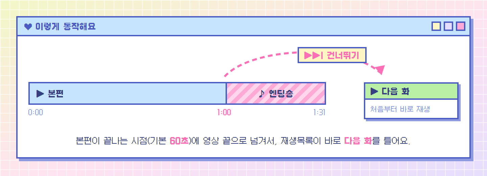
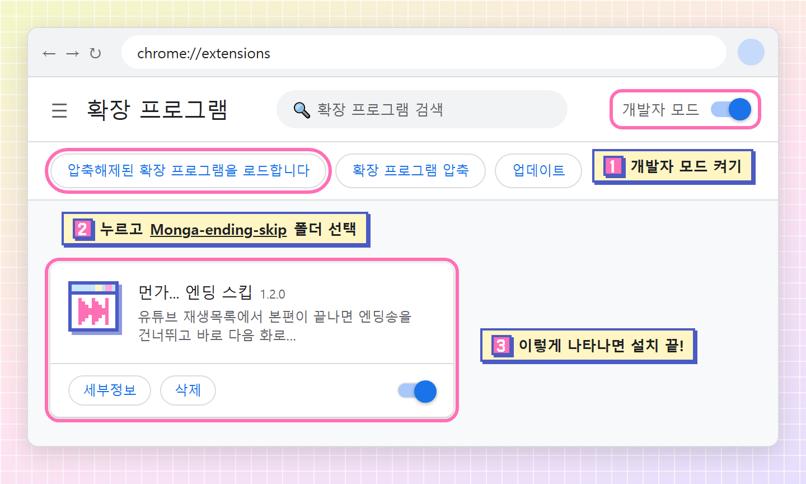
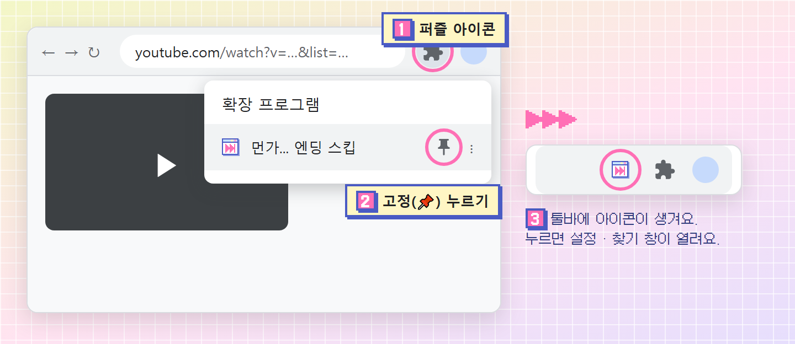
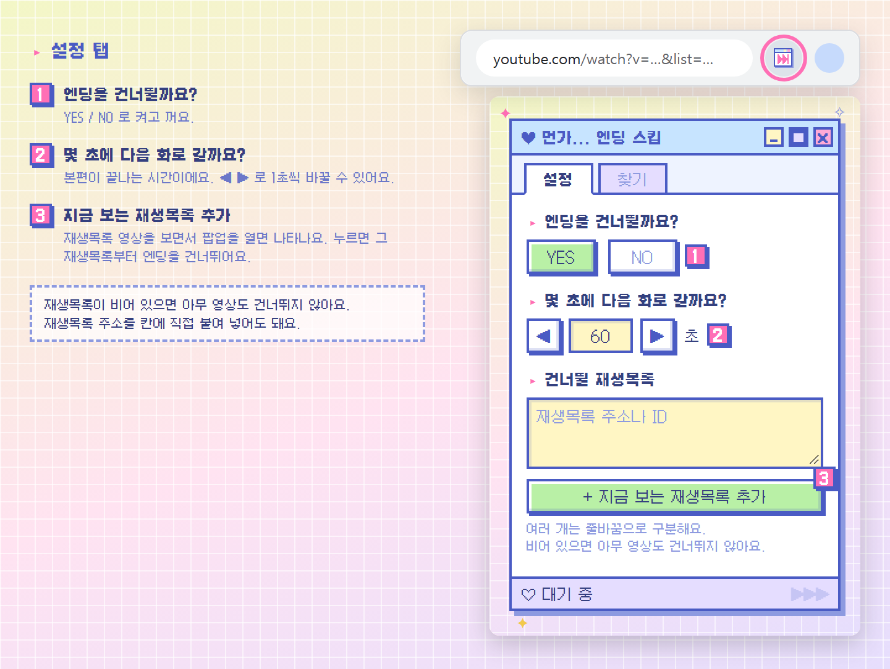
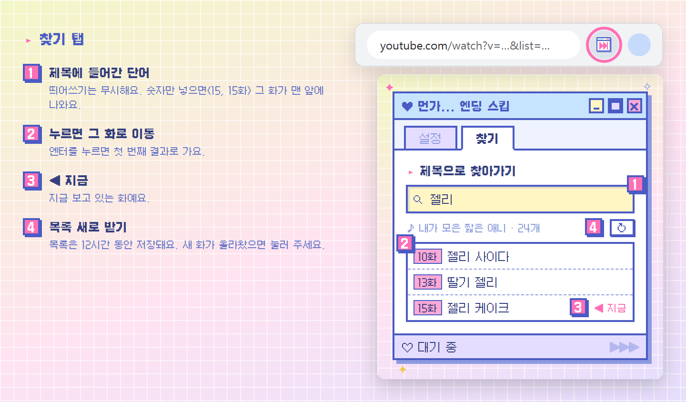

<p align="center">
  
</p>

<h1 align="center">먼가... 엔딩 스킵</h1>

<p align="center">
  유튜브 재생목록에서 짧은 애니메이션을 몰아볼 때,<br>
  본편이 끝나면 엔딩송을 건너뛰고 바로 다음 화로 넘어가는 크롬 확장 프로그램이에요.
</p>

<p align="center">
  
</p>

---

## 기능

### ▶▶| 엔딩 자동 건너뛰기
- **추가해 둔 재생목록**에서 정해 둔 시간(기본 **60초**)이 지나면 영상 끝으로 넘겨서, 재생목록이 곧바로 다음 화를 틀게 해요.
- 마지막 화에서는 그대로 멈춰요.
- 이런 때는 건드리지 않아요.
  - 추가하지 않은 재생목록이나, 재생목록이 아닌 영상
  - 광고가 나오는 동안
  - **3분이 넘는 영상**(재생목록에 섞인 긴 노래 영상 같은 것)

### 🔍 제목으로 찾아가기
- 제목에 들어간 단어나 화 번호로 찾아서, 누르면 그 화로 바로 이동해요.

## 설치

크롬 웹스토어에는 아직 올라가 있지 않아서, 직접 불러와야 해요.

**1. 내려받기**

이 페이지 위쪽의 `Code` → `Download ZIP`으로 내려받아 압축을 풀어요. (`git clone`도 돼요)

**2. 크롬에 불러오기**

크롬 주소창에 `chrome://extensions`를 입력하고, 아래 순서대로 눌러요.



> 폴더는 `manifest.json`이 바로 들어 있는 폴더를 골라요. 이미 열려 있던 유튜브 탭은 새로고침해 주세요.

**3. 툴바에 고정하기**

처음에는 아이콘이 퍼즐 메뉴 안에 숨어 있어요. 고정해 두면 편해요.



**업데이트할 때는** 새 파일로 덮어쓴 뒤 `chrome://extensions`에서 이 확장 프로그램의 새로고침(↻)을 누르면 돼요.

## 사용법

### 설정 — 처음 한 번만

보고 싶은 재생목록의 영상을 연 상태에서 툴바 아이콘을 누르고, **`+ 지금 보는 재생목록 추가`** 를 누르면 끝이에요.
그다음부터는 그 재생목록에서 1분이 지나면 알아서 다음 화로 넘어가요.



> 처음에는 재생목록이 비어 있어서 **아무 영상도 건너뛰지 않아요.** 재생목록 주소를 칸에 직접 붙여 넣어도 되고(`list=` 값만 저장돼요), 여러 개는 줄바꿈으로 구분해요.
> 본편 길이가 다른 애니라면 ② 에서 초를 바꿔 주세요.

### 찾기 — 보고 싶은 화로 바로 가기



- 처음 열 때 재생목록 전체 제목을 받아 와요(몇백 화도 1초 남짓). 받아 온 목록은 12시간 동안 저장해 둬요.
- 지금 보는 재생목록을 먼저 찾고, 재생목록이 아닌 페이지에서는 설정에 추가한 첫 재생목록에서 찾아요.

## 권한과 개인정보

- 요청하는 권한은 **저장소(`storage`)** 하나뿐이에요. 설정값과 받아 온 재생목록 제목을 브라우저 안에 저장하는 데 써요.
- `www.youtube.com` 페이지에서만 동작해요.
- 어떤 정보도 외부 서버로 보내지 않아요. 재생목록 목록은 유튜브 탭 안에서 유튜브에 직접 요청해서 받아 와요.

## 알아 둘 점

- 찾기 기능은 유튜브 페이지의 내부 데이터 형식을 읽어서 목록을 가져와요. 유튜브가 형식을 바꾸면 "목록을 받아 오지 못했어요"가 나올 수 있어요. 엔딩 건너뛰기에는 영향이 없어요.
- 에피소드마다 본편 길이가 조금씩 다를 수 있어요. 엔딩이 일찍 시작하거나 본편이 잘린다면 설정에서 초를 조절해 주세요.

## 파일 구성

```
├─ manifest.json        확장 프로그램 정보
├─ content.js           엔딩 건너뛰기 (유튜브 페이지에서 동작)
├─ playlist.js          찾기에 쓸 재생목록 전체 목록 받아오기
├─ popup.html / .css / .js   툴바 팝업 (설정 · 찾기)
├─ icons/               툴바 · 확장 프로그램 아이콘 (16 / 32 / 48 / 128px)
├─ fonts/               갈무리 픽셀 폰트 + 라이선스
├─ docs/images/         README 이미지
├─ docs/src/            README 이미지 원본 (HTML)
└─ tools/
   ├─ make-icons.js     아이콘 생성기
   └─ render-docs.js    README 이미지 생성기
```

### 아이콘 다시 만들기

아이콘은 [`tools/make-icons.js`](tools/make-icons.js) 안에 16×16 글자 격자로 그려져 있어요. 격자를 고친 뒤 아래를 실행하면 `icons/`의 PNG가 다시 만들어져요. (Node.js 필요, 추가 패키지 없음)

```bash
node tools/make-icons.js
```

### README 이미지 다시 만들기

README 이미지는 `docs/src/`의 HTML을 헤드리스 크롬으로 찍은 거예요. 팝업 그림은 실제 `popup.html`에 예시 데이터를 넣어 찍기 때문에, 팝업을 고친 뒤 다시 실행하면 그림도 같이 바뀌어요. (Node.js와 크롬 필요)

```bash
node tools/render-docs.js
```

크롬이 기본 위치에 없으면 `CHROME` 환경변수로 실행 파일 경로를 알려 주세요.

## 라이선스

- 코드: [MIT License](LICENSE)
- 폰트: [갈무리(Galmuri)](https://github.com/quiple/galmuri) © Lee Minseo — [SIL Open Font License 1.1](fonts/LICENSE.txt)

이 프로젝트는 유튜브나 어떤 애니메이션의 권리자와도 관계없는 비공식 팬 도구예요.
